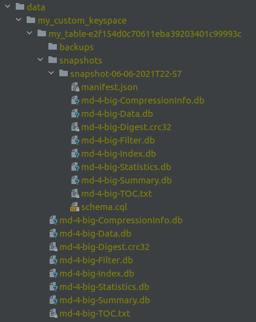

# Cassandra backup by example

In this repository you will find a guide, with examples, to understand how we can manage our backups with Cassandra.

Note: scripts are still WIP. It was tested only on MAC OS.

## Repository structure

* **docker-compose.yaml**: This file start a Cassandra cluster using docker-compose. 
  The cluster mounts outside one data and backup folder by node
* **scripts**: This folder contains all scripts used in this guide
* **scripts/utils**: This folder contains scripts need to be run inside of each container

## Backup Support in Cassandra

Cassandra supports **full backups** (named snapshot) and **incremental backups**, but with some limitations.

Cassandra is a distributed database with a replication factor equal or smaller than the number of nodes in the cluster.
This feature means each node will have a different set of data, and make the backup system more complicated.
In summary, we will need to back up and restore each node in the cluster individually.

Cassandra snapshot (full backup) is managed by the application named *nodetool*.
Nodetool can make snapshots for all or for a set of keyspaces and/or tables. Example:
```bash
nodetool snapshot ${keyspace_name} --tag ${snapshot_name}
```

Cassandra incremental backup is disabled by default but it can be enabled on the configuration file (`cassandra.yaml`), 
setting the value `incremental_backups` to `true`, or using nodetool application `nodetool enablebackup`

## How the backup system works in Cassandra

Cassandra backup system is very simple: it creates a hard link to the [SSTable](https://docs.datastax.com/en/archived/cassandra/3.0/cassandra/dml/dmlHowDataWritten.html) file used to store running data,
so we need to understand Cassandra file structure first.

Cassandra manages stored data in a set of files, with an extension '.db', named SSTables.
Cassandra creates a new SSTable when it consolidates data or is forced to flush or compact data. SSTables are immutables.

Cassandra data files are stored by keyspace and by table version. `data_directory/keyspace_name/table_name-UUID`.

Snapshot data is stored in `data_directory/keyspace_name/table_name-UUID/snapshots/snapshot_name`.

Incremental backup data is managed by Cassandra adding a hard link to each new SSTable created in the host.
This means the backup folder will store all SSTables, but we only need to store all generated files since latest full backup.
Incremental backup data is stored in in `data_directory/keyspace_name/table_name-UUID/snapshots/backups`.



**Note**: a hard link means referenced data will not be deleted if at least one link is still stored in the file system.
That means we will need to delete old data from snapshot folders and maybe backup folders.

## How the backup system works from the operator point of view

As we saw before, Cassandra backup system only consists on creating hard links to the latest database SSTables.
This SSTables are created when Cassandra consolidates data or is asked to create a new snapshot, flush or compact data.
This new SSTable will contain all database data and older SSTables will be deleted.

But the way Cassandra manages them is different for each kind of backup:

* For a new snapshot Cassandra will create the snapshot folder with the links to the latest SSTable.

* For incremental backups Cassandra will create a folder named 'backups',
and it will add a new hard link to each new SSTable, meanwhile automatic backups are enabled.

Once Cassandra creates the new snapshot, or creates the new link to the incremental backup folder, the operator needs to
move those files to a new location for safekeeping (NFS folder, S3 bucket, ...), and delete older backups from Cassandra file system 
(because a hard link prevents referenced file will be deleted until all its links are deleted).
**This operation need to be done for each node individually** (because each node can have different data).

## How restore operation works

To restore a backup we only need to apply the latest table schema (in case it was deleted) 
load all SSTables from the backups of all nodes and repair the table.

Table schema can be found on the latest full backup folder with the name `schema.cql`.

To restore SSTables the operator needs to use the tool `sstableloader`.
This tool takes as input the folder where the backup data is stored, and it needs the format: `keyspace_name/table_name-UUID/SSTable-files.db`

To restore SSTables from incremental backups the operator needs to: created the schema, load the latest snapshot,
and finally load all incremental backups.

## Backup system by example

### Create the cluster

To create the cluster we need to run the script `scripts/create-cluster-wand-wait.sh`.

The scripts will create a docker-compose cluster with 3 Cassandra nodes and wait until the cluster is ready to accept new requests.
This cluster will store Cassandra data in `data/<node-name>` and the backups in `backup/<node-name>`.

### Delete the cluster

To delete the cluster we need to run the script `scripts/destroy-cluster.sh`.

This script will delete the cluster and data and backup folders.

### Configure incremental backups

To configure incremental backups we can modify the configuration file or use nodetool.
In this example we use nodetool for simplicity.

We need to run `scripts/configure-incremental-backup.sh` and the script will run `nodetool enablebackup` on each node in the cluster.

### Insert new data

We can insert new data running the script `scripts/insert-data.sh`.

This script will create a new keyspace named `my_custom_keyspace` and two tables named `my_table` and `my_table_2`.
This keyspace and tables will be used in the examples.

The script can be run more than once and each time will overwrite table data, and Cassandra will create a new SSTable.

### Force incremental backup

We need to run `scripts/force-incremental-backup.sh`.

This script will flush and compact data, causing Cassandra will generate a new SSTable (only if there are new data since last time we run it).

The script will also move the incremental backup folder to external backup storage folder. This script can be configured in a cronjob to make periodical incremental backups.

### Create snapshot (full backup)

We need to run the script `scripts/make-snapshot.sh`.

This script will force an incremental backup, make a new snapshot and move backup data to external storage.

The script will:
* copy all files from latest snapshot to backup folder
* copy all files from latest snapshot to backup folder with `latest` name to make it easier to identify
* Move older latest snapshot to the folder `latest-old` to keep 2 versions of the snapshots
* Move older incremental backup folder to `incremental-backup-older` and create a new folder for the incremental backup to store
SSTables only for the latest snapshot.
  
### Exercise: Insert data, backup, delete table and restore

To do this exercise first we need to create the cluster running `scripts/create-cluster-and-wait.sh`.

Then we need to insert new data `scripts/insert-data.sh`.

And make a snapshot `scripts/make-snapshot.sh`. This step will also enable incremental backups.

Now we can play with the data and run multiple times the script to insert new data, to create a new backup or an incremental backup.

Finally, we can drop the table `scripts/drop-table.sh` that will delete the table named `my_table`.
Drop a table will make Cassandra create a new backup just before delete it, just in case it was a mistake and we want to restore it, but we will use our manual backups.

To restore the table we previously deleted we need to run the script `scripts/resopre-backup.sh`.
This script will apply the schema from the latest snapshot, and restore latest SSTables on each node in the cluster.

## Backup pipeline

Once we know how the backup system works in Cassandra we decide how to configure the backup pipeline.

The best approach is to have a mix of full backups and incremental backups with different periodicity between them, and maybe between different keyspaces.
The periodicity may change in the future because data restrictions or changes in the SLA with developers and customers.


The pipeline proposal is:

Make a full backup (snapshot) in a weekly basis. This snapshot should apply for all keyspaces in the cluster.
Enable incremental backups and move the data to the backup storage every 1 hour for specific keyspaces.


**Note**: for the backup storage system we will need to store the full content of the database (or the keystore) per each node in the cluster,
and we should keep at least the 2 latest snapshots and incremental backups.
